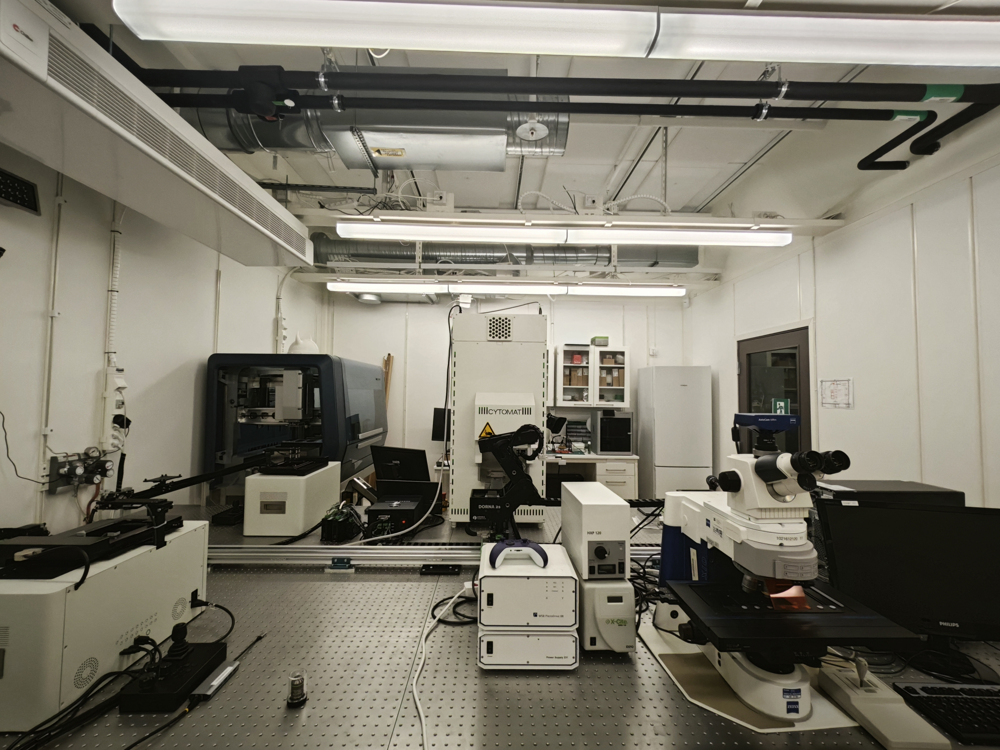

# REEF Imaging

A platform for automated microscope control, image acquisition, data management, and analysis for reef biological experiments.

## Overview

REEF Imaging provides a comprehensive system for automated microscopy workflows including:
- Hardware control for microscopes, robotic arms, and incubators
- Image acquisition and processing
- Data management and storage through Hypha platform
- Analysis tools for biological experiments

## Lab Setup



Check out our system demonstration video:
[REEF Imaging System Demo Video](https://drive.google.com/file/d/1nQLgzMsSR3JCzMfe99mdpwYSvpYZAS7q/view?usp=sharing)

## Project Structure

- **reef_imaging/** - Main package
  - **control/** - Hardware control modules
    - **dorna-control/** - Control for Dorna robotic arm
    - **cytomat-control/** - Control for Cytomat incubator
    - **squid-control/** - Control for SQUID microscope
    - **mirror-services/** - Services for mirroring data between cloud and local systems
  - **hypha_tools/** - Utilities for working with the Hypha platform
    - **artifact_manager/** - Tools for interacting with Hypha's artifact management system
    - **automated_treatment_uploader.py** - Uploads time-lapse experiment data
    - **automated_stitch_uploader.py** - Processes and uploads stitched images
  - **orchestrator.py** - Main orchestration system
  - **hypha_service.py** - Hypha service integration

## Installation

First, clone the repository and set up the environment:

```bash
git clone git@github.com:aicell-lab/reef-imaging.git
cd reef-imaging
conda create -n reef-imaging python=3.11 -y
conda activate reef-imaging

# Install squid-control in editable mode
git clone git@github.com:aicell-lab/squid-control.git
pip install -e squid-control

# Install the package and its dependencies
pip install -e .
```

## Usage

### Start Hypha Server

Before starting, make sure you've installed Docker and docker-compose.

1. **IMPORTANT**: Set permissions for HTTPS
   ```bash
   chmod 600 traefik/acme/acme.json
   ```

2. Create an `.env` file based on the template in `.env-template`

3. Configure your settings in `docker-compose.yaml`

4. Create the Docker network
   ```bash
   docker network create hypha-app-engine
   ```

5. Start the application containers
   ```bash
   docker-compose up -d
   ```

6. Start the traefik service
   ```bash
   cd traefik && docker-compose up -d
   ```

7. After a few minutes, your site should be running at https://reef.aicell.io

### Start Hypha Services

To run the main service:
```bash
python -m reef_imaging.hypha_service
```

### Running the Orchestrator

To run the main orchestration system:
```bash
python orchestrator.py
```

For local development and testing:
```bash
python orchestrator_simulation.py --local
```

## Environment Setup

The system requires environment variables for authentication:

```
# For cloud operation
REEF_WORKSPACE_TOKEN=your_token_here
SQUID_WORKSPACE_TOKEN=your_token_here

# For local development
REEF_LOCAL_TOKEN=your_local_token
REEF_LOCAL_WORKSPACE=your_local_workspace
```

## Hardware Control Services

The system integrates with multiple hardware components:

- **Microscope Control**: Manages SQUID microscope for imaging, stage positioning, and illumination
- **Robotic Arm Control**: Handles sample transfer between microscope and incubator
- **Incubator Control**: Manages sample storage and environmental conditions
- **Mirror Services**: Proxies requests between cloud and local systems

## Restart Hypha

```
docker-compose restart hypha
```

## Documentation

For more detailed information, see the README files in each subdirectory:
- `reef_imaging/README.md` - Main codebase overview
- `reef_imaging/control/README.md` - Hardware control systems
- `reef_imaging/hypha_tools/README.md` - Hypha integration tools
- `reef_imaging/hypha_tools/artifact_manager/README.md` - Artifact management utilities