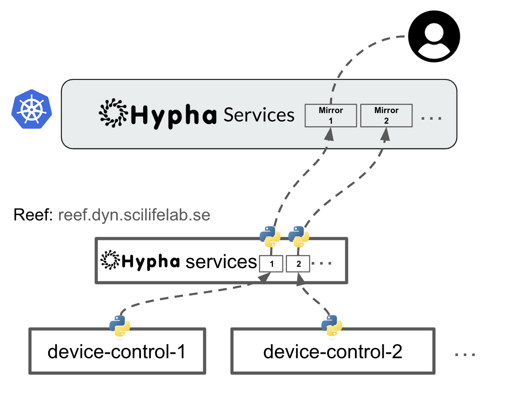

# REEF Imaging Control Systems

This directory contains the hardware control modules for the REEF imaging system, providing interfaces for automated microscopy, robotic sample handling, and incubation control through Hypha services.

## System Architecture

The control system consists of four main components:

1. **Microscope Control** - Manages the SQUID microscope for imaging
2. **Robotic Arm Control** - Controls the Dorna robotic arm for sample handling
3. **Incubator Control** - Manages the Cytomat incubator for sample storage
4. **Mirror Services** - Proxies requests between cloud and local systems

Each component exposes a standardized API through Hypha services, allowing orchestration by the main reef-imaging system.

## Hardware Control Services

### Microscope Control (`squid-control/`)

The SQUID microscope control service manages imaging, stage positioning, and illumination.

- **Core Features:**
  - Stage movement (X/Y/Z positioning)
  - Multiple illumination channels (BF, 405nm, 488nm, 561nm, 638nm, 730nm)
  - Auto-focus capabilities (contrast-based and reflection-based)
  - Well plate scanning with specified parameters
  - Image acquisition and storage

- **Main File:** `start_hypha_service_squid_control.py`

### Robotic Arm Control (`dorna-control/`)

The Dorna robotic arm control service handles sample transfer between the microscope and incubator.

- **Core Features:**
  - Sample pickup and placement operations
  - Preconfigured movement paths
  - Transport operations between microscope and incubator
  - Status monitoring and error recovery
  - Safety controls

- **Main Files:**
  - `start_hypha_service_robotic_arm.py` - Hypha service interface
  - `dorna_controller.py` - Direct controller interface
  - `paths/` - Predefined robot movement paths

### Incubator Control (`cytomat-control/`)

The Cytomat incubator control service manages sample storage and environmental conditions.

- **Core Features:**
  - Sample loading/unloading from slots
  - Temperature and CO2 level monitoring
  - Sample status tracking
  - Error handling and recovery

- **Main Files:**
  - `start_hypha_service_incubator.py` - Hypha service interface
  - `samples.json` - Sample metadata and status tracking

### Mirror Services (`mirror-services/`)

These services act as proxies between the cloud Hypha server and local hardware control services, enabling remote operation.

- **Core Features:**
  - Secure remote control of local hardware
  - Health monitoring and automatic reconnection
  - Request forwarding with error handling
  - Synchronized operation between cloud and local systems

- **Main Files:**
  - `mirror_squid_control.py` - Microscope mirror service
  - `mirror_robotic_arm.py` - Robotic arm mirror service
  - `mirror_incubator.py` - Incubator mirror service

## Service Health Monitoring

All services implement a health check mechanism that:
- Monitors service connectivity
- Automatically reconnects if disconnected
- Logs errors and status information
- Tracks task status for operations
- Provides recovery mechanisms

## Environment Setup

### Prerequisites

- Python 3.7+
- Hypha server (local or cloud)
- Device-specific dependencies:
  - SQUID microscope drivers
  - Dorna robot control libraries
  - Cytomat incubator interface

### Environment Variables

The services require these environment variables:

```
# For cloud operation
REEF_WORKSPACE_TOKEN=your_cloud_token

# For local operation
REEF_LOCAL_TOKEN=your_local_token
REEF_LOCAL_WORKSPACE=your_local_workspace
```

### Starting Services

To start services locally(with the local server in lab):

```bash
# Start incubator control
cd cytomat-control
python start_hypha_service_incubator.py --local

# Start robotic arm control
cd dorna-control  
python start_hypha_service_robotic_arm.py --local

# Start microscope control
cd squid-control
python start_hypha_service_squid_control.py --local

## Service Architecture

Each service follows a similar pattern:
1. Registration with the Hypha server
2. Exposure of a standardized API
3. Background health monitoring
4. Task status tracking for operations
5. Error handling and recovery

This architecture allows for modular development and robust operation, with each component handling its specific hardware while maintaining a consistent interface for the orchestration layer.

## Communication Flow



The mirror services ensure that commands from the cloud platform are securely and reliably transmitted to the local hardware control services, enabling remote operation while maintaining local safety controls.