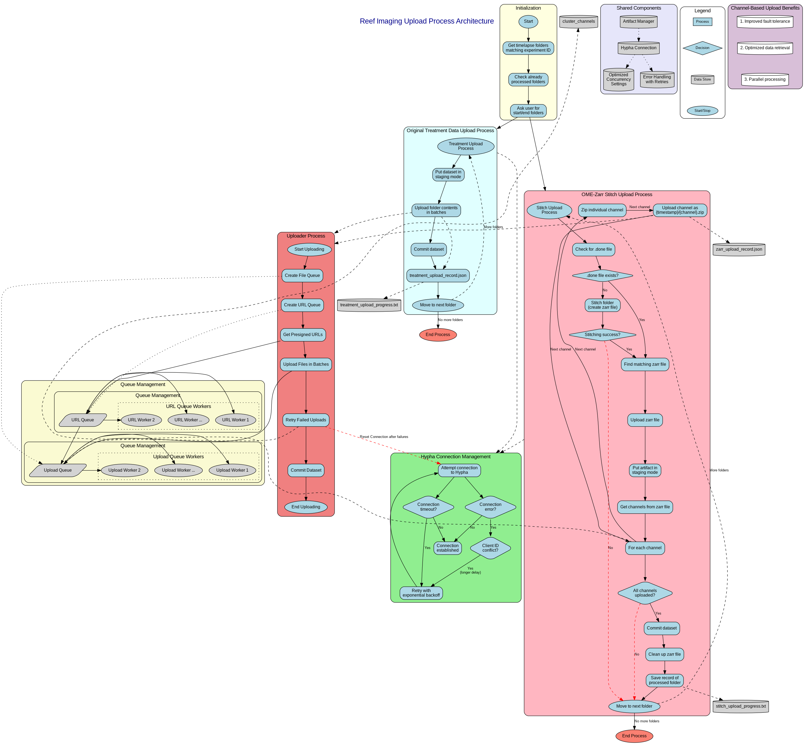

# Reef Imaging Upload Process Documentation

This documentation describes the simplified workflow for uploading imaging data from the reef system to Hypha.

## Workflow Diagram

The workflow diagram shows two primary processes:
1. **Treatment Data Upload Process** - Used by `automated_treatment_uploader.py`
2. **OME-Zarr Stitch Upload Process** - Used by `automated_stitch_uploader.py`

Both processes share common initialization steps but handle data differently based on their specific requirements.



## Key Components

### Common Initialization
Both uploaders start with:
- Getting all timelapse folders matching the experiment ID
- Checking already processed folders
- Asking the user for start/end folders to process

### Treatment Upload Process
Simple workflow for uploading treatment data:
1. Connect to Hypha with retry mechanism
2. Put dataset in staging mode
3. Zip and upload the folder contents
4. Commit the dataset
5. Save a record of the processed folder
6. Move to the next folder

### OME-Zarr Stitch Upload Process
More complex workflow for stitching and uploading zarr files:
1. Check for existing .done file to avoid re-stitching
2. Stitch folder to create zarr file if needed
3. Find matching zarr file
4. Connect to Hypha with retry mechanism
5. Put artifact in staging mode
6. Process and upload each channel separately
7. Commit dataset when all channels are uploaded
8. Clean up zarr files
9. Save record of processed folder
10. Move to next folder

### Error Handling
Both processes implement robust error handling:
- Connection retries with exponential backoff
- Staging retries with graceful reconnection
- Commit retries with connection refresh and timeout handling

## How to Regenerate the Diagram

Run the following command to regenerate the workflow diagram:

```bash
cd reef_imaging/hypha_tools/artifact_manager/docs
./generate_diagram.sh
```

This requires Graphviz to be installed on your system.

## Implementation Details

For detailed implementation, refer to:
- `automated_treatment_uploader.py` - For treatment data upload
- `automated_stitch_uploader.py` - For stitched zarr data upload
- `artifact_manager/` - Shared utilities for both uploaders 